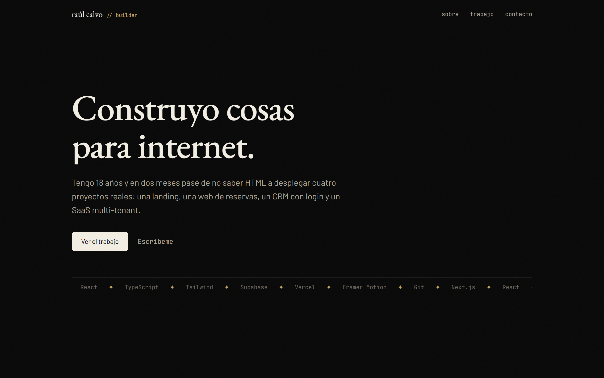

# Portfolio Hub

The entry point to Raúl Calvo's portfolio: a static, single-page site that frames four deployed web projects, tells the story behind them, and centralizes contact. Built to read "this person ships real products" in about 30 seconds.

**Live:** [raulcalvo.vercel.app](https://raulcalvo.vercel.app)



## What it is

A dark, editorial one-pager. Four real projects are presented as an asymmetric editorial index (large gold numerals, full-size real screenshots, alternating alignment) rather than a uniform card grid. Motion is varied per section (choreographed word reveal in the hero, line reveals in the about section, clip-path image wipes in the work index) and fully respects `prefers-reduced-motion`.

The four projects it aggregates:

| # | Project | What it is | Demo | Code |
|---|---------|------------|------|------|
| 01 | Kōmbu | Dark-premium landing for an author Japanese restaurant in Madrid | [demo](https://p1-kombu.vercel.app) | [repo](https://github.com/trustinraul/p1-kombu) |
| 02 | Fortuna | Tattoo studio with real-time bookings and an admin panel | [demo](https://p2-fortuna.vercel.app) | [repo](https://github.com/trustinraul/p2-fortuna) |
| 03 | Archon | Full-stack CRM for freelancers: clients, projects, tasks, invoices, with auth + RLS | [demo](https://p3-archon.vercel.app) | [repo](https://github.com/trustinraul/p3-archon) |
| 04 | Ingegno | Multi-tenant SaaS: a premium public profile for polymaths and builders | [demo](https://p4-ingegno.vercel.app) | [repo](https://github.com/trustinraul/p4-ingegno) |

## Stack

- **Framework:** Next.js 16 (App Router), 100% static (SSG)
- **UI:** React 19 + Tailwind CSS v4 (`@theme` tokens)
- **Motion:** Framer Motion v12
- **Fonts:** EB Garamond (display) + Barlow (body) + JetBrains Mono (labels), via `next/font/google`
- **Tests:** Jest + ts-jest (node env, data-integrity only)
- **Deploy:** Vercel

No database, no backend, no auth. Contact is a direct `mailto:`.

## Features

- Asymmetric editorial work index with real project screenshots and per-row `demo` / `código` links
- Sticky nav with scroll-spy
- Choreographed, section-varied motion with full reduced-motion support
- Accessible: skip-to-content link, visible focus rings, `aria-current` nav state, descriptive image labels
- SEO: per-route OpenGraph image (`summary_large_image`), `metadataBase` driven by an env var for a one-line domain switch

## Local development

```bash
npm install
npm run dev      # http://localhost:3000
```

Other scripts:

```bash
npm run build    # production build (SSG)
npm run start    # serve the production build
npm run lint     # eslint
npm test         # data-integrity tests
```

## Environment variables

| Variable | Purpose | Default |
|----------|---------|---------|
| `NEXT_PUBLIC_SITE_URL` | Canonical site URL for `metadataBase` and OpenGraph. **Must be a fully-qualified URL with protocol** (e.g. `https://raulcalvo.vercel.app`). | `https://raulcalvo.vercel.app` |

## Notes

- The CV is available in two languages: `public/cv-raul-calvo-es.pdf` (Spanish, primary) and `public/cv-raul-calvo-en.pdf` (English), linked from the contact section.
- Project thumbnails in `public/projects/` are live screenshots of the four deployed demos.

## Adding a project

Append an object to the `projects` array in [content/projects.ts](content/projects.ts). The work index renders the list in order; no JSX changes needed.
